# Workshop 2: Secure Movie analytics pipeline

In this Lab, you will enhance [workshop 1: MovieAnalytics](./Workshop_1_MovieAnalytics.md) in which Azure Data Factory's visual authoring experience to create a pipeline that copies movie data stored in Azure Data Lake Storage Gen2 to a separate location in that storage account and then executes a Mapping Data Flow to transform and write the data to a Azure SQL Database.

In this workshop, this pipeline will be secured. The following steps are taken:


- **Authentication/authorization**: Connect to Storage account and Azure SQL using System Assigned Managed Identities rather than keys
- **Networking**: Connect to Storage account and Azure SQL using private endpoints rather than public internet
- **Parametrization**: Parameterize pipeline to facilitate unit testing and deployment to dev/tst/prd
- **Data Exfiltration Protection**: Whitelist domains that ADF can use to communicate

## Prerequisites

* **Azure subscription**: If you don't have an Azure subscription, create a [free account](https://azure.microsoft.com/free/) before you begin.

* **Azure Data Lake Storage Gen2 storage account**: If you don't have an ADLS Gen2 storage account, see the instructions in [Create an ADLS Gen2 storage account](https://docs.microsoft.com/en-us/azure/storage/blobs/data-lake-storage-quickstart-create-account).

* **Azure SQL Database**: If you don't have an Azure SQL Database, see the instructions in [Create an Azure SQL database](https://learn.microsoft.com/en-us/azure/azure-sql/database/single-database-create-quickstart?view=azuresql&tabs=azure-portal). Database is needed in the last step to write the data to, an empty database can be created.

## Setting up your environment

**Create your data factory:** Use the [Azure Portal](https://portal.azure.com) to create your Data Factory. Detailed instructions can be found at [Create a Data Factory](https://docs.microsoft.com/azure/data-factory/quickstart-create-data-factory-portal). 

1. Once in the Azure Portal, click on the **All Services** button on the left hand-side and select "Data Factories" in the Analytics section.
    

1. Click **Add** to open the Data Factory creation screen
    

1. Specify your Data Factory configuration settings in the creation pane. Choose a globally unique data factory name and select your subscription, resource group, and region. Your data factory must be version V2. Once you are done, click **Create**. Your data factory may take a couple minutes to deploy.
    * Mapping Data Flow is not currently available in the following data factory regions: West Central US, Korea Central and France Central. For the purposes of this lab, please do not create your data factory in one of these reasons. 
    * ADF's integration with Azure DevOps and Github will not be covered in this lab. To enable this feature, check **Enable Git** and specify your configuration information. See [Source Control in Azure Data Factory](https://docs.microsoft.com/azure/data-factory/source-control#troubleshooting-git-integration).
    

1. Make sure that the option "Enable Managed VNET is selected".

    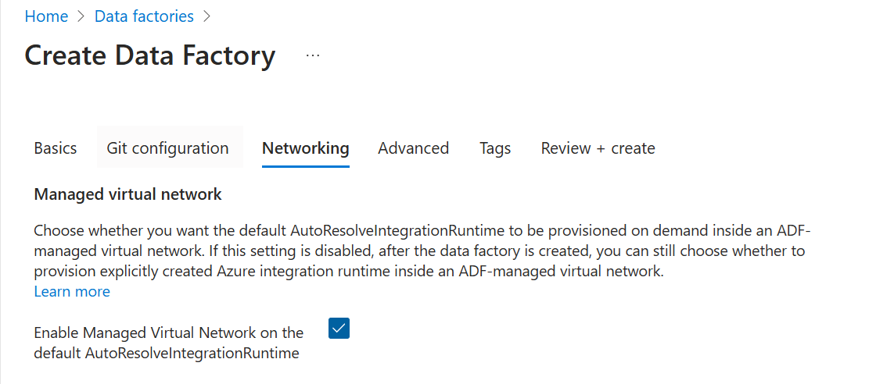


## Deploy Movie analytics pipeline

1. There are two possibilities to create the movie analytics pipeline:
   - Follow the steps in [Workshop 1](./Workshop_1_MovieAnalytics.md). Depending on your experience, it takes 1-2 hours to deploy pipeline in 
   - Deploy [ARM template](./demo-adfmovie-adf/ARMTemplateForFactory.json) template in the demo-adfmovie-adf directory

In the remainder of this chapter, template deployment is described. 

1. Go to the Azure Portal, go to the search bar in the top and enter **Deploy a custom template** in the bar. Then select option **Build your own template in the editor**
    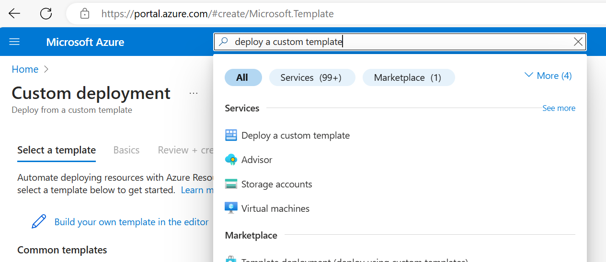

1. Copy the content of [ARM template](./demo-adfmovie-adf/ARMTemplateForFactory.json) and click **save**

    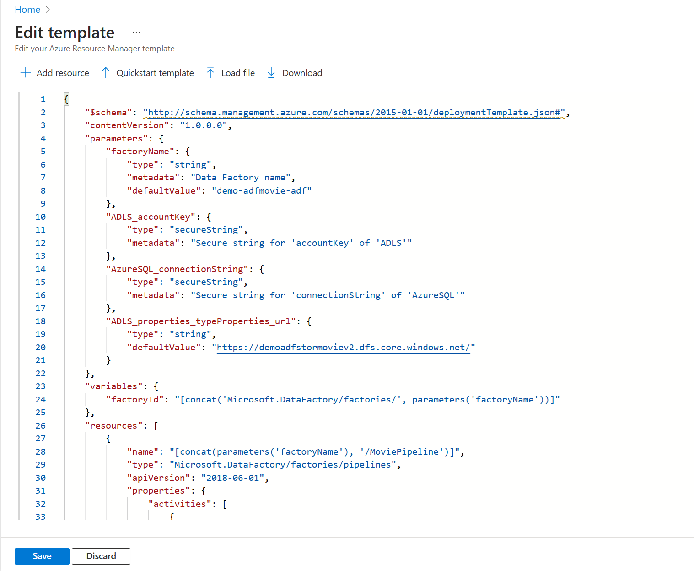
    

1. Fill in the required parameters in the content of [Deploy ADF](./new_images_rbr/103_deploy_adf_arm.png). For Parameters, use the following:
   - Resource group: Resource group in which ADF with managed VNET is deployed
   - Factory name: Data Factory name deployed earlier
   - ADLS_account Key: Account key of ADLS storage account deployed earlier
   - Azure SQL_connection String: Connection string deployed earlier. SQL shall have the following form: `integrated security=False;encrypt=True;connection timeout=30;data source=<<your sql server name>>.windows.net;initial catalog=<your database name>>;user id=<<your username>>;password=<<your password>>`
   - ADLS properties URL: URL of your storage account

1. Then click **Review + create** and check whether pipeline was succesfully deployed.

    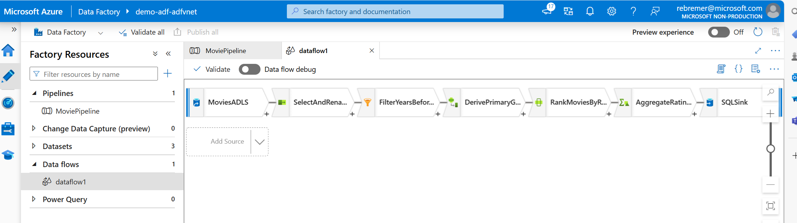


## Turn on data flow debug mode

In section *Transforming Data with Mapping Data Flow*, you will be building mapping data flows. A best practice before building mapping data flows is to turn on debug mode which allows you to test transformation logic in seconds on an active spark cluster.

To turn on debug, click the **Data flow debug** slider in the factory top bar. Click ok when the confirmation dialog pop-ups. The cluster will take about 5-7 minutes to start-up. Continue on to *Ingesting data into Azure Data Lake Storage Gen2* while it is initializing.


  
## Running the Pipeline

Go to the pipeline canvas. In the Execute Data Flow activity's settings tab, you will see the data flow selected and the compute environment used. In this lab, you should use the default 4 core general purpose cluster. 

Before you publish your pipeline, run another debug run to confirm it's working as expected. 


Look at the **Output** tab, you can monitor the status of both activities as they are running. You can click on the eyeglasses icon next to the Data Flow activity to get a more in depth look at the Data Flow run.


In the detailed view, you can see how long each transformation stage takes, view each transformations partitioning information and see how long it took to write to the sink.


The data flow activity should complete in about one minute. If you used the same logic described in this lab, your Data Flow should will written 737 rows to your Azure SQL Database. You can go into [SQL Server Management Studio](https://docs.microsoft.com/sql/ssms/download-sql-server-management-studio-ssms?view=sql-server-2017) to verify the pipeline worked correctly and see what got written.


## Authentication/Authorization: Connect to Storage account and Azure SQL using System Assigned Managed Identities rather than keys##

1. Go to your Azure Storage account that you deployed. Select **Access Control (IAM)** , select the role `Storage Blob Data Contributor` and move to the next pane. Select  `Managed Identity` and then look up the Azure Data Factory to which you deployed the VNET.

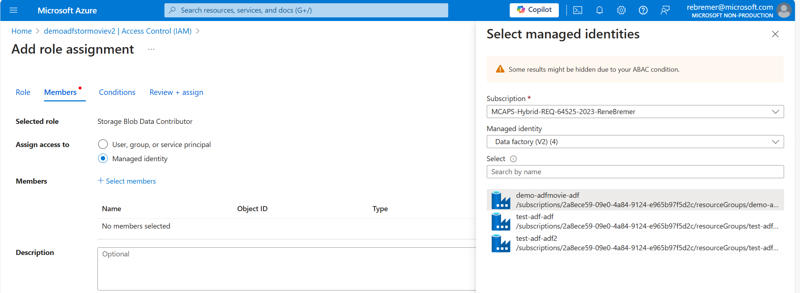

Then click `save` and verify that ADF managed identity was added as Storage Blob Data Contributor on the storage account

1. Go to your Azure Data Factory, select the ADLS linked service and change **Authentication Type** to **System Assigned Managed Identity**. Then this the connection (make sure that you have interactive auditing enabled on Managed VNET) 

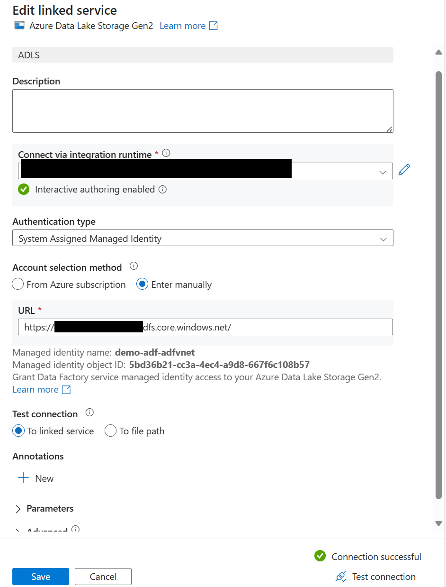.

1. Go to your Azure SQL Database that you deployed. You can go into [SQL Server Management Studio](https://docs.microsoft.com/sql/ssms/download-sql-server-management-studio-ssms?view=sql-server-2017) and login to your database. Notice that you should log in using the Azure AD Identity since the ADF MI will be added and this can only be done from another Azure AD user (and not via a user that authenticated via local SQL authentication)

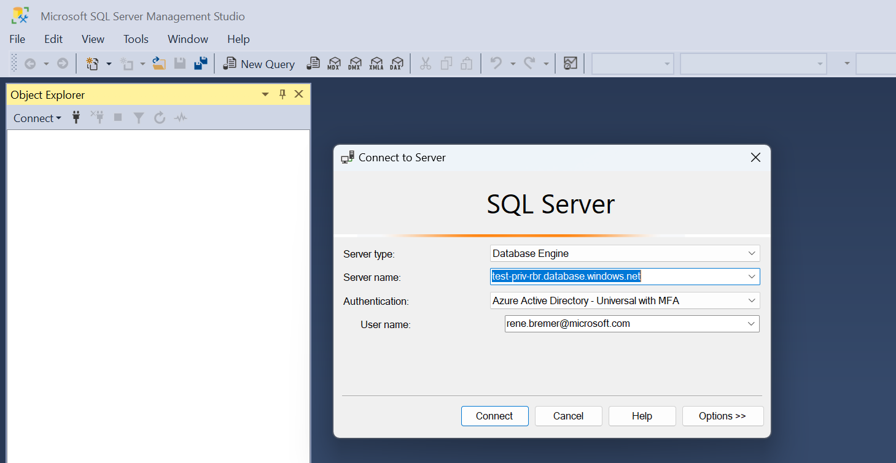

1. Go to database that you deployed earlier and select **New Query**. The run the following script:

```
CREATE USER [<<Azure Data Factory Name>>] FROM EXTERNAL PROVIDER;
EXEC sp_addrolemember [db_datawriter], [<<Azure Data Factory Name>>]
```

1. Go to your Azure Data Factory, select the Azure SQL linked service and change **Authentication Type** to **System Assigned Managed Identity**. Then this the connection (make sure that you have interactive auditing enabled on Managed VNET)

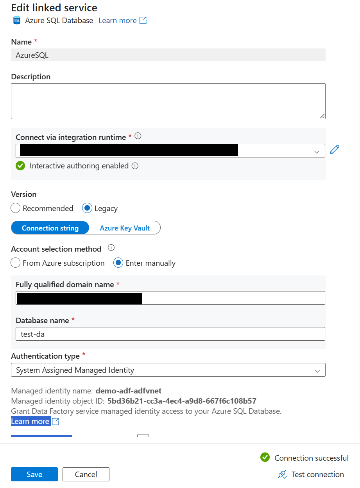.

1. Click on save and then publish all changes.

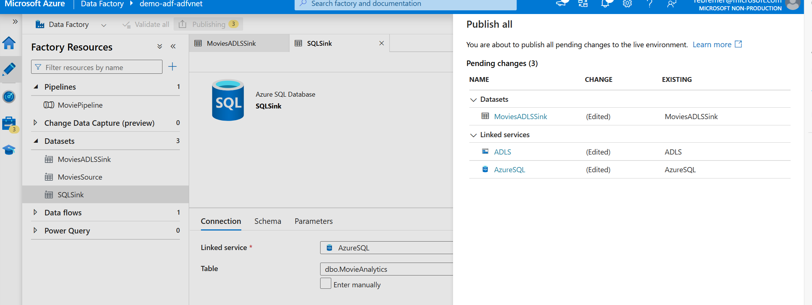.

After the pipeline was published, all authentication is done via Managed Identities. That is, no credentials are needed anymore that shall be managed by the customer.


## Networking - Connect to Storage account and Azure SQL using private endpoints rather than public internet

1. Go to your Azure Data Factory, select the **Managed private endpoints** and select **Azure Data Lake Storage Gen 2** and the select the ADLSgen2 account that you created. 

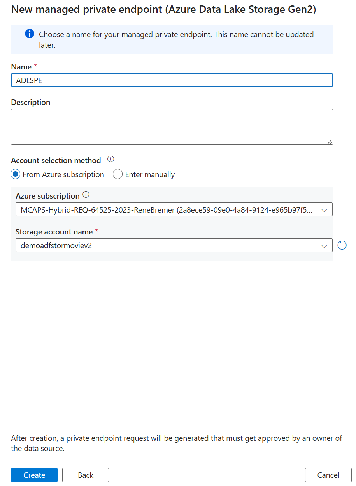.

1. After PE, you PE on the storage account is pending. This is because the PE needs to be approved (it is not possible to just create private endpoints to any service in the enterprise). 

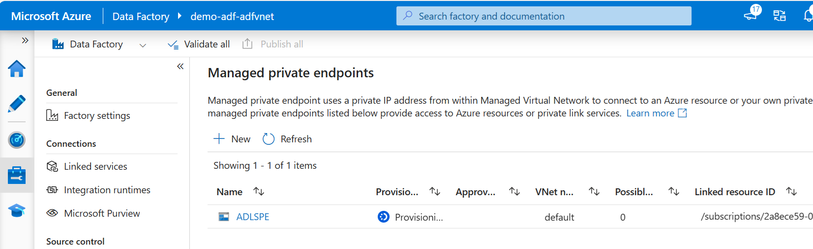.

1. Go to storage account and then approve the private endpoint

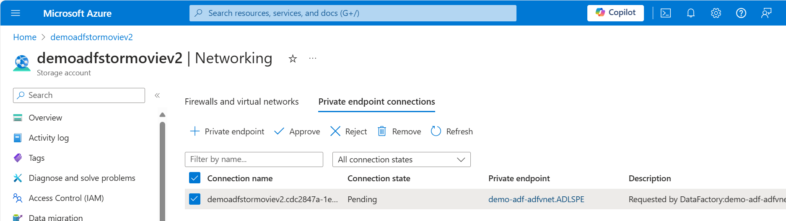.

1. Since ADF managed VNET can now access the storage account via its private endpoint, the storage account can be disabled from public access. Go th

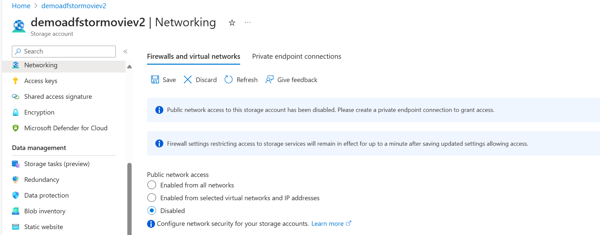.

1. The steps for ADLSgen2 are now completed. You will notice that you can lookup your data anymore in your ADLSgen2 in the Azure Portal, you will need to have connectivity to the Azure Storage account, for instance, via the managed VNET of ADF.

1. The same steps will now be executed for Azure SQL. Create an private endpoint request to Azure SQL from ADF, approve request in Azure SQL and then disable public access in Azure SQL. Azure SQL dataa cannot be accessed anymore from SSMS on your laptop, unless your laptop has access to the Azure SQL environment.


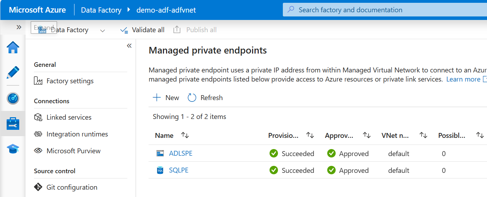.


1. After all private endpoints are created and deployed, pipeline can run. Pipeline is now enhanced such that no credentials are needed to connect to data sources and data sources do not have to be exposed to the public interne

## Parametrisation - Parameterize pipeline to facilitate unit testing and deployment to dev/tst/prd

1. Next step is to parameterize the data sources. This will make it easier to deploy ADF to dev/tst/prd environments and configure data sources accordingly. In this case, the public data source that is used to fetch the movie data will be parameterized. Firstly, create a global parameter that contains the public data source.

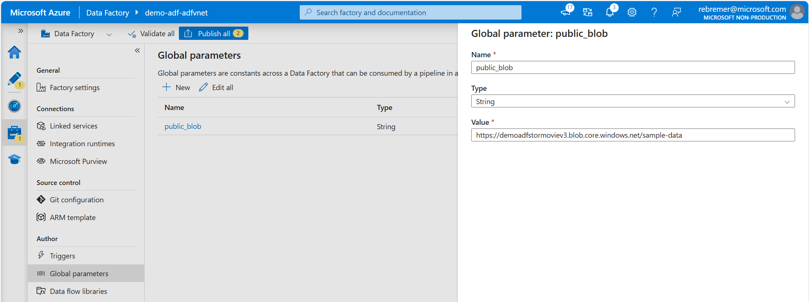.

1. The value of this parameter needs to be propagated all the way through the linked service. Therefore, create a local parameter at the linked service.

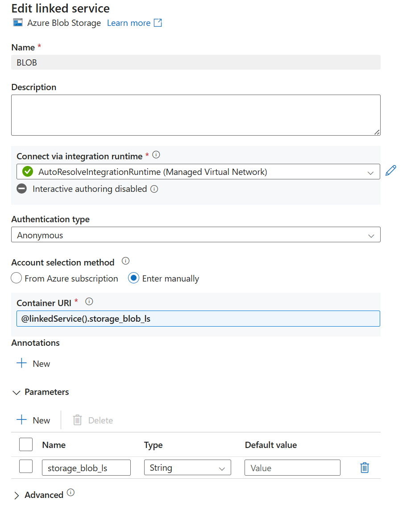.

1. Similarly, create a local parameter at the data set that is used by the blob linked service.

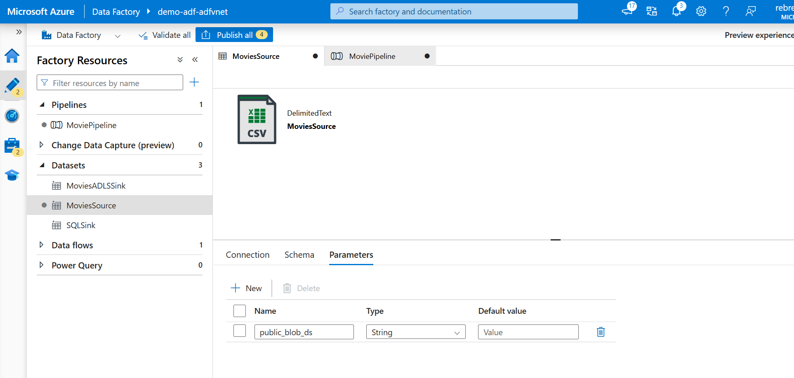.

1. The value of the dataset local parameter shall be used in the local parameter that is passed into the linked service.

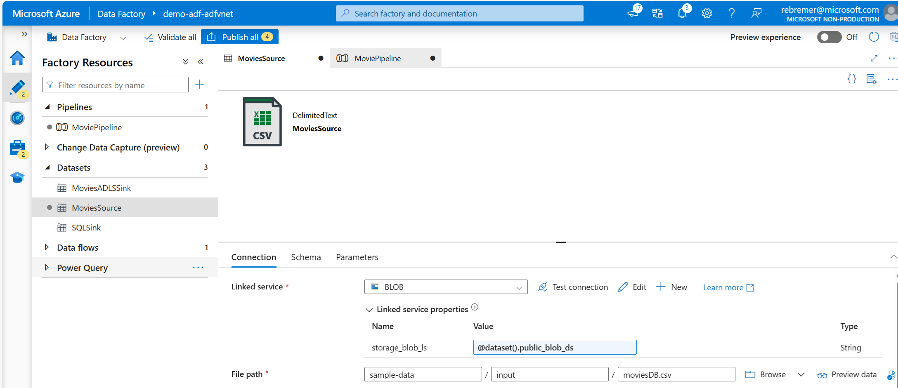.

1. Finally, the value of the global parameter shall be used in the local parameter of the dataset that is eventually passed to the linked service.

.


Publish all changed and you can run pipeline again. It is now easy to substitute the ADF pipeline from a public source to an internal source.

## Data Exfiltration Protection: Whitelist domains that ADF can use to communicate

1. Go to your Azure Data Factory, select the **Manage** and select **Outbound rules** and then enable option **Use Azure Policy (preview)**.

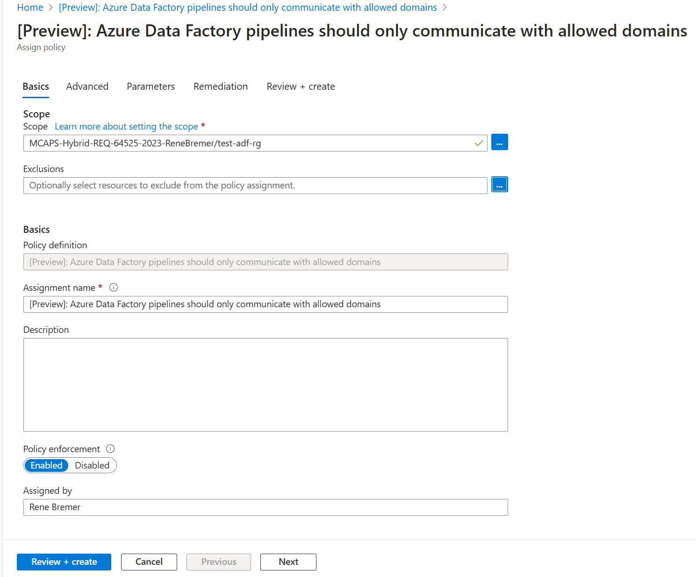.

1. Go to [Azure policies examples for ADF](https://learn.microsoft.com/en-us/azure/data-factory/policy-reference) and select the first policies **Azure Data Factory pipelines should only communicate with allowed domains**. Deploy this policies in your own environment that you scope to your own subscription and own resource group. As an example, use **www.google.com** as allowed domain.

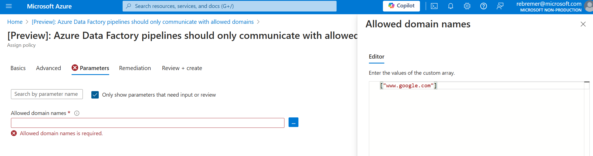.

1. Go to your ADF pipeline and run the pipeline again. It will fail since ADF tries to fetch data from a domain that was not whitelisted. Notice that technically moviede data is retrieved from an external domain and not exfiltratrated, but for ADF this is just connecting to an external domain.

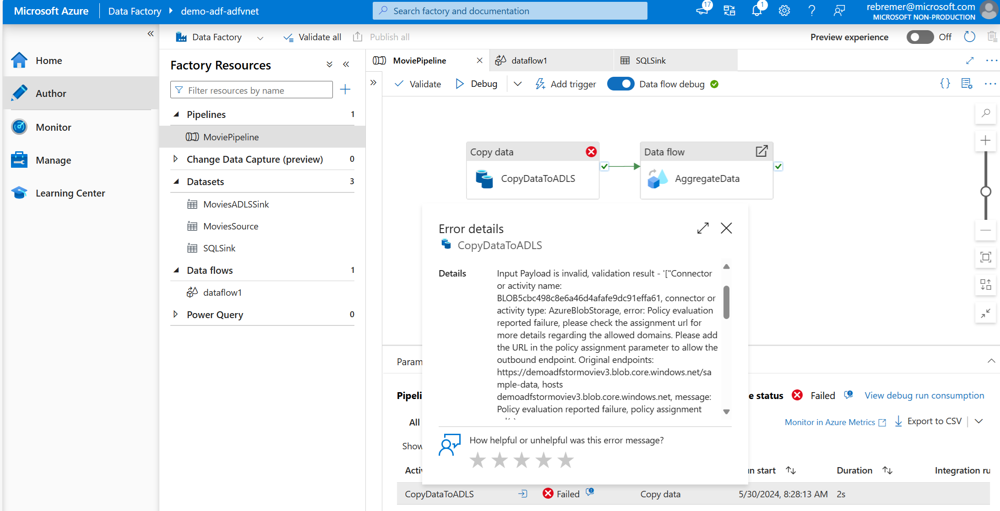.

1. Add the domain **demoadfstormoviev3.blob.core.windows.net** to your domain and run pipeline again. There are two other domains that need to be whitelisted (your storage, your SQL). When all domains are whitelisted, pipeline can run succesfully again

.

In four steps, the pipeline was secured as follows:

- **Authentication/authorization**: Connect to Storage account and Azure SQL using System Assigned Managed Identities rather than keys
- **Networking**: Connect to Storage account and Azure SQL using private endpoints rather than public internet
- **Parametrization**: Parameterize pipeline to facilitate unit testing and deployment to dev/tst/prd
- **Data Exfiltration Protection**: Whitelist domains that ADF can use to communicate

As a follow-up, the data factory pipeline can be further secured using Azure DevOps dev/tst/prd environment and unit testing. This is dicussed in blogs below:

- https://towardsdatascience.com/how-to-manage-azure-data-factory-from-dev-to-prd-ab7c8a2d10ae
- https://towardsdatascience.com/how-to-build-unit-tests-for-azure-data-factory-3aa11b36c7af
- https://towardsdatascience.com/how-to-bring-your-modern-data-pipeline-to-production-2f14e42ac200
- https://towardsdatascience.com/how-to-connect-azure-ad-managed-identities-to-aws-resources-9353f3309efb